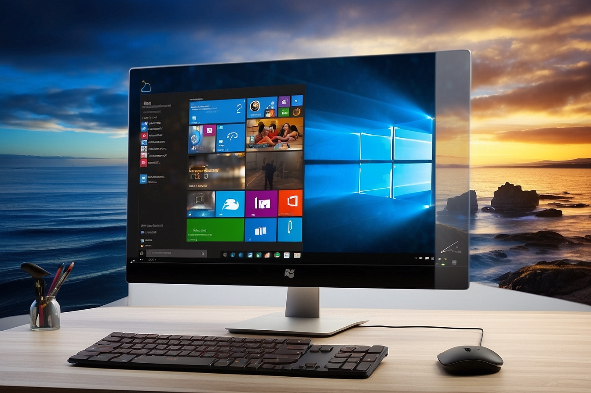

# Optimización y Mejora de Rendimiento para Sistemas
- ¡Bienvenido al Repositorio de Optimización y Mejora de Rendimiento para Sistemas! Aquí encontrarás una colección de recursos, herramientas y ajustes que te permitirán llevar el rendimiento de tu sistema al siguiente nivel, ¡y lo mejor de todo es que es completamente gratuito!

# ¿Por qué hay que optimizar?
- Hay que optimizar el hardware y software para mejorar su rendimiento y eficiencia. La optimización del hardware  y software puede ayudar a que los dispositivos funcionen más rápido, consuman menos energía y sean más duraderos.

# ¿Qué puedes encontrar aquí?
- Configuraciones avanzadas del registro de Windows para afinar el rendimiento.
- Herramientas para ajustar parámetros de hardware y software de manera inteligente.
- Guías y tutoriales detallados sobre cómo optimizar tu sistema paso a paso.
- Estrategias para reducir los tiempos de carga y mejorar la velocidad general.
- Consejos para deshabilitar características innecesarias y liberar recursos valiosos.
- Información sobre cómo evitar cuellos de botella y optimizar el uso de la CPU y la GPU.

Nuestro 'objetivo es proporcionarte todas las herramientas que necesitas para llevar tu experiencia informática al siguiente nivel'. Ya seas un usuario ocasional o un profesional de la informática, encontrarás algo útil en este repositorio para potenciar tu sistema y disfrutar de un rendimiento excepcional.

# Creación y Uso de Puntos de Restauración
- Un punto de restauración es una copia de seguridad del estado del sistema de Windows en un momento dado. Estos puntos son útiles para revertir el sistema a un estado anterior en caso de problemas.

# Crear un Punto de Restauración
- Para generar un punto de restauración en Windows, sigue estos pasos:
1. Abre la aplicación **Configuración**.
2. Haz clic en **"Sistema"**.
3. En la pestaña **"Protección del sistema"**, haz clic en **"Crear"**.
4. Escribe un nombre descriptivo para el punto de restauración y haz clic en **"Crear"**.

- Windows creará un punto de restauración en la unidad del sistema. El tamaño del punto de restauración dependerá de las modificaciones realizadas en el sistema desde el último punto de restauración.

# Restaurar el Sistema a un Punto de Restauración
-Si surge un problema con el sistema, puedes restaurarlo a un punto de restauración siguiendo estos pasos:
1. Abre la aplicación **Configuración**.
2. Haz clic en **"Sistema"**.
3. En la pestaña **"Protección del sistema"**, haz clic en **"Restaurar sistema"**.
4. Selecciona el punto de restauración al que deseas volver y haz clic en **"Siguiente"**.
5. Sigue las instrucciones en pantalla para completar la restauración del sistema.

# Cada cuanto crear un Punto de Restauración
- Es aconsejable generar un punto de restauración antes de realizar cambios significativos en el sistema, como la instalación de nuevas aplicaciones o controladores de hardware. También es prudente crear un punto de restauración antes de llevar a cabo actualizaciones de Windows.

# Cantidad de Puntos de Restauración
- No existe un número específico de puntos de restauración que debas generar. Sin embargo, es recomendable crear al menos un punto de restauración cada semana para contar con una variedad de opciones de restauración.

# Perfil XMP (Intel Extreme Memory Profile)
El **Perfil XMP** (Intel Extreme Memory Profile) es una tecnología que permite que las memorias RAM DDR4 y DDR5 funcionen a sus velocidades y tiempos de latencia especificados por el fabricante. Por defecto, la memoria RAM funciona a velocidades más bajas para garantizar la compatibilidad con la placa base.

## Cómo Activar el Perfil XMP
Para activar el Perfil XMP, sigue estos pasos:

1. Reinicia tu computadora y entra en la configuración de la BIOS.
2. Accede a la sección de configuración de la memoria RAM.
3. Busca la opción **"Perfiles XMP"** o **"Intel Extreme Memory Profile"**.
4. Selecciona el perfil XMP que deseas activar.
5. Guarda los cambios y reinicia tu computadora.

Una vez que hayas activado el Perfil XMP, tu memoria RAM funcionará a sus velocidades y tiempos de latencia especificados por el fabricante. Esto puede mejorar el rendimiento de tu computadora en tareas que requieren un uso intensivo de la memoria RAM, como el juego o la edición de video.

## Consejos para Activar el Perfil XMP
- Antes de activar el Perfil XMP, es recomendable realizar una copia de seguridad de tu BIOS. Esto te permitirá restaurar tu BIOS a su configuración original si algo sale mal.
- Si tienes problemas para activar el Perfil XMP, consulta el manual de tu placa base para obtener más información.
- Algunos perfiles XMP pueden causar inestabilidad en tu sistema. Si experimentas problemas después de activar el Perfil XMP, intenta seleccionar un perfil diferente o desactivar el Perfil XMP.

## Ventajas y Desventajas de Activar el Perfil XMP
**Ventajas:**
- Mejora el rendimiento de la memoria RAM.
- Permite que la memoria RAM funcione a su velocidad y tiempos de latencia especificados por el fabricante.
- Es una forma sencilla de mejorar el rendimiento de tu computadora.

**Desventajas:**
- Puede causar inestabilidad en el sistema.
- No todos los perfiles XMP son compatibles con todas las placas base.

# **Funciones Destacadas:**
- **Habilitar TRIM (solo SSD):** Utiliza el comando ```fsutil behavior set disabledeletenotify 0``` para habilitar TRIM en unidades SSD y mantener su rendimiento a largo plazo.
- **Verificar y Reparar Archivos del Sistema:** Ejecuta `sfc /scannow` para verificar y reparar archivos del sistema dañados o faltantes, manteniendo la integridad del sistema.
- **Comprobar y Restaurar la Integridad de la Imagen de Windows:** Utiliza los comandos `DISM /Online /Cleanup-Image /CheckHealth` para verificar y restaurar la integridad de la imagen de Windows en caso de problemas.
- **Analizar y Desfragmentar Disco Duro (solo HDD):** Optimiza la disposición de datos en discos duros ejecutando comandos `defrag`, mejorando el rendimiento de unidades HDD.
- **Reparar Errores y Sectores Defectuosos:** Utiliza `chkdsk C: /f` para analizar y corregir errores de archivos y sectores defectuosos en tu disco principal.
- **Habilitar Compresión de Archivos:** Ahorra espacio en disco habilitando la compresión de archivos en la unidad principal con `compact /c /s:"C:\"`.
- **Desactivar el Temporizador de Eventos de Alta Precisión (HPET):** Utiliza `bcdedit /deletevalue useplatformclock` para desactivar el temporizador de eventos de alta precisión, lo que puede mejorar la latencia en sistemas específicos.

# Licencia
Este proyecto está bajo la licencia [Creative Commons Attribution 4.0 International License](https://creativecommons.org/licenses/by/4.0/). Puedes compartir, adaptar y utilizar estos archivos siempre que des el crédito correspondiente al autor original.

# Nota importante
Se recomienda encarecidamente hacer una copia de seguridad de los datos importantes antes de continuar. El autor no se hace responsable de ningún daño o problema causado por el mal uso de estas tecnicas.
